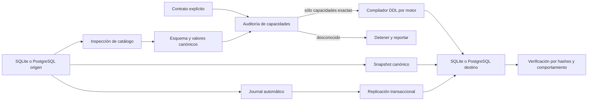

# Arquitectura

## Objetivo

El sistema coloca una representación canónica entre SQLite y PostgreSQL. Ningún componente debe considerar una transformación como exacta si no puede reconstruir y comprobar su semántica en los dos motores.

## Componentes

### Contrato y auditoría

`compat.Contract` identifica motor, versión y capacidades requeridas. `Audit` devuelve un `Finding` por capacidad y `RequireExact` rechaza cualquier estado distinto de `exact`.

Las capacidades `canonical_*` se refieren exclusivamente a objetos expresados mediante el AST común. Las familias genéricas representan SQL arbitrario del motor y permanecen `unknown` mientras falte cobertura completa.

### Esquema canónico

`compat.Schema` modela:

- tablas, columnas y tipos;
- claves primarias, `UNIQUE`, claves foráneas y `CHECK`;
- índices únicos, parciales y descendentes;
- vistas, joins, filtros, agrupaciones y orden;
- triggers con acciones `INSERT`, `UPDATE` y `DELETE`;
- rutinas transaccionales parametrizadas.

No se aceptan fragmentos de SQL opacos dentro del esquema. Expresiones, acciones y consultas se representan como nodos estructurados para poder compilarlos por separado.

### Compilación física

`CompileDDL` genera las sentencias físicas del motor de destino. Algunas familias usan una representación deliberadamente conservadora:

- decimal en SQLite: texto canónico para evitar pérdida IEEE-754;
- JSON y UUID: texto para evitar normalizaciones que cambien la representación;
- timestamp: texto RFC3339Nano para conservar nanosegundos y zona original antes de su normalización canónica.

### Persistencia e inspección

`ApplySchema` guarda el esquema completo en `__compat_schema`. Si esos metadatos existen, `InspectSchema` reconstruye exactamente el AST original.

Para bases externas sin metadatos, los inspectores consultan `sqlite_master`/pragmas o los catálogos PostgreSQL. Los objetos dentro de la gramática común se traducen; cualquier objeto restante aparece en `Inspection.Unresolved` y hace que `Inspection.Exact` sea `false`.

### Snapshots

`ExportSnapshot` convierte cada valor del driver a `compat.Value`. `ImportSnapshot` crea el esquema y carga las filas dentro de una transacción. `VerifySnapshots` compara hashes canónicos sin depender del orden físico de las filas.

La importación es aditiva: no borra ni reemplaza tablas existentes.

### Replicación

`InstallChangeCapture` crea triggers internos y `__compat_change_journal`. `ReadCapturedChanges` entrega cambios ordenados por secuencia. `ApplyChanges`:

- aplica un stream de un solo origen dentro de una transacción;
- registra secuencias en `__compat_applied_changes` para permitir reintentos;
- compara la imagen `before` antes de actualizar o eliminar;
- devuelve `ConflictError` ante divergencia;
- inhibe temporalmente la captura para evitar ecos infinitos.

Todas las tablas capturadas necesitan una clave primaria canónica.

### Runtime común

Las rutinas canónicas y la búsqueda Unicode se ejecutan desde Go para obtener el mismo comportamiento en ambos motores. El runtime no intenta ejecutar procedimientos arbitrarios del dialecto contrario.

## Tablas internas

Los siguientes nombres están reservados:

- `__compat_schema`;
- `__compat_applied_changes`;
- `__compat_capture_state`;
- `__compat_change_journal`;
- triggers y funciones cuyo nombre empieza con `__compat_capture_`.
